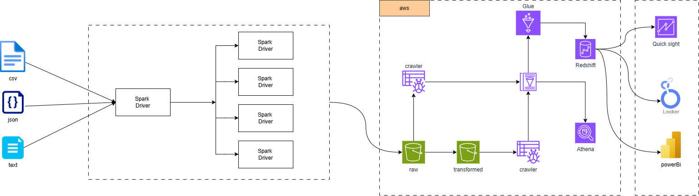
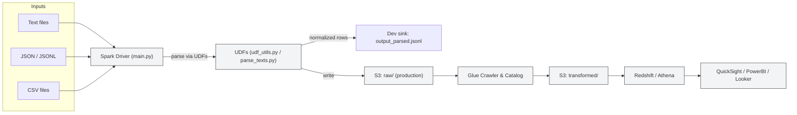

# Spark Unstructured Streaming (AWS) — README

This repository implements a simple pipeline for ingesting unstructured job posting documents (text, JSON/JSONL, CSV),
parsing them into a normalized schema using parsing utilities/UDFs, and storing the results for downstream analytics via
AWS services (S3, Glue, Redshift, Athena) and BI tools.

## Quick plan for this README

- Overview and purpose
- Architecture & Data Flow (plain language + mermaid diagram)
- Files / Folder layout (what to look at)
- How to run locally (quick commands)
- Inputs / Outputs (examples & locations)
- UDFs & parsing logic (where code lives and how it works)
- Next steps and security notes

---

## Overview

This project demonstrates an ETL-style pipeline focused on unstructured documents (job postings). It shows how to:

- Ingest files in multiple formats (text, JSONL, CSV)
- Parse and normalize content using parsing functions (UDFs) in `udf_utils.py` and `parse_texts.py`
- Stream/process files with a Spark Structured Streaming job (`main.py`) and write results to a sink (local JSONL for
  dev; S3 in production configured via `config.py`)
- Use AWS Glue to catalog data and load into analytics engines (Redshift/Athena) and visualize with BI tools

## Architecture & Data Flow (summary)


Plain-language data flow:

1. Data sources: files are dropped into input locations (local `input/` during development or S3 buckets in production).
   Supported formats: `text` (free-form labeled files), `json/jsonl`, and `csv`.
2. Ingestion: Spark Structured Streaming (`main.py`) reads new files (text mode with `wholetext=true`) and sends each
   file's content through parsing UDFs.
3. Parsing & normalization: parsing functions in `udf_utils.py` (and `parse_texts.py` for a local runner) extract
   structured fields such
   as `file_name`, `position`, `classcode`, `salary_start`, `salary_end`, `start_date`, `end_date`, `req`, `notes`, `duties`, `selection`, `experience_length`, `job_type`, `education_length`, `school_type`,
   and `application_location`.
4. Persistence: parsed records are written to a sink (local `output_parsed.jsonl` for dev). In the architecture diagram,
   processed records are written to S3 (`raw` and `transformed`), then cataloged by AWS Glue (crawlers and Data
   Catalog), and pushed into analytics stores (Redshift, Athena) for BI (QuickSight, PowerBI, Looker).
5. Downstream: BI and analytic engines query cataloged/cleaned data for dashboards and reporting.

Mermaid diagram (simplified):



> The included Draw.io XML (`spark_unstructured_streaming_aws.drawio.xml`) maps the same flow: CSV/JSON/TEXT inputs ->
> Spark parsing drivers -> S3 (raw & transformed) -> Glue Crawler/Data Catalog -> Redshift/Athena -> BI.

## Files / Folder layout (important files)

- `main.py` — Spark Structured Streaming entrypoint; defines UDFs mapping and reads text stream.
- `udf_utils.py` — parsing helper functions (extract_file_name, extract_position, extract_salary, extract_start_date,
  extract_end_date, extract_requirements, etc.). These are used both by the local parser and intended Spark UDF
  registration.
- `parse_texts.py` — local-run parser that consumes `input/input_text/*.txt` and writes `output_parsed.jsonl` for
  development/testing without Spark.
- `validate_inputs.py` — simple validator for sample CSV/JSONL files against the expected schema.
- `config.py` — loads settings from `.env` (via python-dotenv) and exposes `configs` (AWS keys, etc.).
- `input/` — sample inputs:
    - `input/input_text/` — labeled text job files (e.g. `job1.txt`, `job2.txt`)
    - `input/input_json/` — json/jsonl samples (sample_jobs.jsonl)
    - `input/input_csv/` — csv samples (sample_jobs.csv)
- `output_parsed.jsonl` — generated by `parse_texts.py` (dev output).
- `spark_unstructured_streaming_aws.drawio.xml` — Draw.io diagram of system architecture (source for this README's
  architecture section).

## How to run locally (development)

Prerequisites:

- Python 3.8+ (3.12 tested in dev environment)
- (Optional) Spark if you want to run `main.py` streaming locally

Install Python dependencies (virtualenv recommended):

```powershell
python -m venv .venv; .\.venv\Scripts\Activate.ps1
pip install --upgrade pip
pip install python-dotenv
```

Run the input validator (quick sanity check):

```powershell
python validate_inputs.py
```

Parse text files locally without Spark (fast dev loop):

```powershell
python parse_texts.py
# Output: printed parsed JSON and file 'output_parsed.jsonl'
```

Run the Spark streaming job (requires local Spark installation or cluster):

- If you have Spark installed locally and pyspark available, you can run:

```powershell
python main.py
```

- To run on a Spark cluster, package and submit with `spark-submit` and include needed jars (hadoop-aws, aws-sdk), e.g.:

```powershell
spark-submit --packages org.apache.hadoop:hadoop-aws:3.3.1,com.amazonaws:aws-java-sdk:1.11.469 main.py
```

Note: `main.py` reads AWS credentials via `config.py` (which loads `.env`). For local dev you can either
set `AWS_ACCESS_KEY`/`AWS_SECRET_KEY` in `.env` or rely on IAM roles when running in AWS.

## Inputs / Outputs (examples)

- Sample CSV: `input/input_csv/sample_jobs.csv`
- Sample JSONL: `input/input_json/sample_jobs.jsonl`
- Sample text files: `input/input_text/job1.txt`, `job2.txt`
- Dev output: `output_parsed.jsonl` (one JSON object per line) produced by `parse_texts.py`

## UDFs & parsing logic

- `udf_utils.py` contains the primary parsing helpers. These functions are intentionally robust:
    - `extract_file_name(content)` — returns first non-empty line
    - `extract_position(content)` — returns second non-empty line
    - `extract_classcode(content)` — regex for `Class Code: ...`
    - `extract_salary(content)` — regex for `Salary: <start> - <end>` returns (float, float)
    - `extract_start_date` / `extract_end_date` — parse `YYYY-MM-DD` from labeled lines
    - `_extract_label_value(content, label)` — generic helper to extract `Label: value` lines

These functions are used directly in `parse_texts.py` (dev runner) and also registered as Spark UDFs in `main.py`
via `define_udf()`.

If you plan to deploy to a Spark cluster, ensure the UDFs are serializable and packaged with your application or
available on the cluster's Python environment.

## Next steps and recommendations

- Tests: Add unit tests (pytest) for `udf_utils.py` covering edge cases (missing labels, malformed salaries, alternative
  date formats).
- Improve parsing: support alternative label spellings and richer salary formats (e.g., ranges with currency symbols)
  and add fallback NLP extraction if labels are absent.
- Productionization: write processed records to S3 in partitioned Parquet, create Glue ETL jobs for transformations, and
  configure Glue Catalog properly for Athena/Redshift.
- Observability: add logging, metrics (counts, parse errors), and retries for transient AWS failures.

## Security notes

- Do NOT commit real credentials. Add `.env` to `.gitignore` and use IAM roles (ECS/EKS/EMR) or AWS Secrets Manager for
  production.
- Limit IAM permissions to least privilege for S3/Glue/Redshift.

---

If you want, I can also:

- Generate a PNG/SVG of the mermaid diagram and add it to the repo,
- Add unit tests for `udf_utils.py`,
- Create a `requirements.txt` file with pinned dependencies,
- Produce a `spark-submit` example with exact cluster configs for EMR or Dataproc.

Which of the above would you like me to do next?
